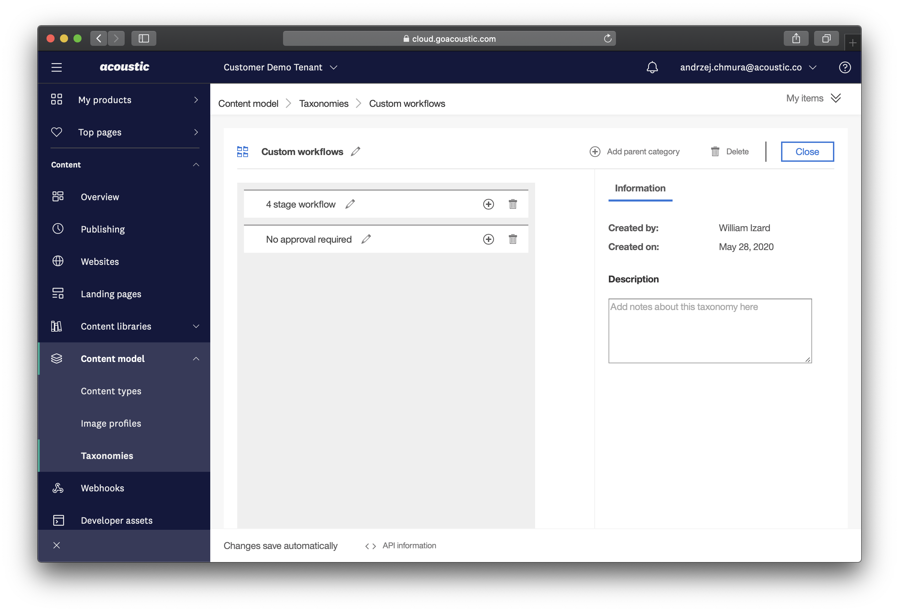

## Set up a custom workflow by integrating Acoustic Content with a task management system

This is a tutorial about creating a custom workflow that can contain multiple approval stages by integrating with Trello. We use Zapier to coordinate the two systems. The same approach can be used to set up an custom workflow with any other task management tool such as JIRA or Zenhub etc.

For background information on all the tutorials, see: https://github.com/ibm-wch/sample-custom-workflows-using-webhooks.

## Workflow overview

The overall workflow looks like this:

1. Content Admin defines the workflow.
2. Content Editor creates draft items and submits them for review.
3. First line approver approves the items.
4. Second linke approver approves the items.
5. Content Editor publishes the items once fully approved.

## Zaps overview

We will use multiple Zaps to handle the entire workflow from start to finish:

1. Approve the review using a webhook
2. Initialize custom workflow
3. Synchronize comments for 3 stage workflow for images
4. Synchronize comments for 4 stage workflow for web site content
5. 3 stage workflow for images
6. 4 stage workflow for web site content

## Preparation

#### Acoustic Content

1. In the Acoustic Content user iterface, go to Settings -> User management and add a new "functional user" as a Manager. Let's call this user "External Approver". Our editors will choose this "user" as the approver when they want to make use of the custom workflow. This user will also be used to execute the custom workflow tasks in the Content API.


2. Define the custom workflows as Taxonomies. In the Acoustic Content user iterface go to Content model -> Taxonomies and Create taxonomy. In this example, we will call this 'Custom workflows'. Next, add a category for each custom workflow you want to provide. In our examples this is:
- 3 stage workflow for images
- 4 stage workflow for web site content
- No approval required



3. Open an existing Content Type or create a new Content type. Use the Categories field to tag this Content Type with the workflow that should be used for Content of this type. This could be for example an 'Article (no approval)' Content type, with category 'No approval required' we defined before. We use this field to determine which custom workflow should run.


#### Trello

1. Sign up to a free Trello account or use your existing Trello account.
2. Create a new team. A personal board can not be used due to the limitations they have, which we will be highlighted later.
3. Create a new board for each workflow that requires a Trello board for management. In our case, this will be '3 stage workflow for images' and '4 stage workflow for web site content'.

## Approve review by webhook Zap.

Create a new Zap and call it 'Approve review by webhook'. This Zap uses only two steps:
- Catch the webhook
- `POST` request to Acoustic Content API to approve a content item.

### Catch the webhook

- Create a webhook step in Zapier.
- Choose to Catch a Hook. Copy the URL of the webhook. This will be needed in other Zaps.

### Add `POST` request

- Add 'Webhooks by Zapier' step.
- Select `POST` request.
- Set the url to `[[API_URL]]>/authoring/v1/review/<querystringId>/approve`, where <querystringId> is the `Id` parameter extracted from the initial request. 
- Add Acoustic Content credentials for the "External Approver" user that you created previously under the **Basic Auth** section.

Calling this webhook with an `id` parameter as a query string will approve the Content Item in Acoustic Content.

## Initialize custom workflow Zap.

Create a new Zap and call it 'Initialize custom workflow'. 

This Zap uses multiple steps:
- Catch the webhook
- Extract `docId`, `approverEmail` and `creatorEmail` data from the webhook request
- Fire API request to `GET` the neccessary data from the Content API
- Extract the `category` from the content item
- Depending on the specified `category`, decide if the item should be immediately approved or should fall into one of the specified workflows
- If no approval is required, fire the API call to the approval API
- Otherwise, find a board in Trello specific to that custom workflow, and create a new card with all the necessary info
- Send an email to notify the approvers about the new review

### Catch the webhook

- Create a webhook step in Zapier.
- Choose to Catch a Hook. Copy the URL of the webhook.
- In a new browser tab, go to the Webhooks in Acoustic Content. 
- Add a webhook, and paste the copied URL.
- Set the filters as event type "Create" and item type "Reviews".
- Add the webhook.

### Create a review

- Navigate to the Acoustic Content and compose a new content item using of the content types we just created. Let's start with the 'Article (no approval)' content type. Populate the content item with some dummy data and create a new Review. In the Approvers section, pick the External Approver user we created in **Preparation**. 


### Extract data from webhook request

- Add 'Code by Zapier' step.
- Select 'Run JavaScript'.
- Set the input data. Extract the fields from the webhook that will be needed in the next steps. In this example, we'll extract the fields `<docItems>` and `<docApprovers>`. So, enter `items` as the input data field name, and select the `Doc Items` variable from the webhook. Repeat this for `<docApprovers>` (called `approvers`).
- Add the following code code:

```js
const docId = inputData.items.split("\n")[1].split(" ")[1];
const approverEmail = inputData.approvers.split("\n")[0].split(" ")[1];

output = {docId: docId, approverEmail: approverEmail};
```

### Add `GET` request for Content Item

- Add 'Webhooks by Zapier' step.
- Select `GET` request.
- Set the url to `[[API_URL]]>/authoring/v1/content/<docId>`, where <docId> is the Document Id extracted from the previous step.
- Add your Acoustic Content credentials under the **Basic Auth** section. This should take either the form `<username>|<password>` or `apikey|<api key value>` **(see note on security below)**.  

**Note on base request url**:
`[[API_URL]]` can be retrieved from your Acoustic Content user interface. See Overview -> Hub info -> API URL.

**Note on security**:
In this example, we are entering Acoustic Content Authentication information in plain text into the Zap, which would be visible to anyone with access to your Zapier account. If this is considered a security issue, an alternative would be to use a "Zapier Integration" which allows the creator of the Zap that uses the integration to enter Authentication information that is then stored in a secure manner.

### Add `GET` request for Content Type  

Repeat the instructions from the previous step, but this time request the data about the Content Type:

- Add 'Webhooks by Zapier' step.
- Select `GET` request.
- Set the url to `[[API_URL]]>/authoring/v1/types/<typeId>`, where <typeId> is the Type Id extracted from the initial request.
- Add your Acoustic Content credentials under the **Basic Auth** section.

### Add another code step

- Add 'Code by Zapier' step.
- Select 'Run JavaScript'.
- Set the input data. Extract the field from the webhook that will be needed in the next steps. This time, we'll extract the field `<categories>`. So, enter `categories` as the input data field name, and select the `Categories` variable from the webhook.
- Add the following code:

```js
const category = inputData.categories.split('/')[1];

output = {category: category};
```

### Add branching logic with Paths

This is where things are starting to get interesting. Now we need to decide which workflow is going to run, depending on the Category specified for Content Type. 

- Add 'Paths by Zapier' step.

### (Path A - no approval required) Setup

- Step into the Path A and rename it. Let's call this 'No approval required'
- Under the 'Rules Setup & Testing' section specify when this particular path should be executed. In our case, this will look like this:

Only continue if...

`<category>` -> (Text) Exactly Matches -> No approval required

Where `<category>` is the variable we extracted in the previous step.

### (Path A - no approval required) Add `POST` request

For this particular workflow, where external approval is no required, all we have to do is fire a `POST` request to the Content API. 

- Add 'Webhooks by Zapier' step.
- Select `POST` request.
- Set the url to `[[API_URL]]>/authoring/v1/review/<docId>/approve`, where <docId> is the Doc Id extracted from the initial request.
- Add Acoustic Content credentials for the user External Approver under the **Basic Auth** section.

At this point, the Content Item will be immediately approved in Acoustic Content user interface.

### (Path B - 3 stage workflow for images) - Setup

- Step into the Path B and rename it. Let's call this '3 stage workflow for images'
- Under the 'Rules Setup & Testing' section specify when this particular path should be executed. In our case, this will look like this:

Only continue if...

`<category>` -> (Text) Exactly Matches -> 3 stage workflow for images

### (Path B - 3 stage workflow for images) - Find board in Trello

- Add 'Trello' step in Zapier.
- Select 'Find Board' action.
- Provide Trello credentials or pick already connected Trello account.
- Under the 'Customize Board' select the Trello team you created in the **Preparatio - Trello** step, and provide the right Board Name - in our case this will be '3 stage workflow for images'. Use Zapier's test feature to make sure that it is able to find the correct board in your Trello team.

### (Path B - 3 stage workflow for images) - Create Card in Trello

- Add another 'Trello' step in Zapier.
- Select 'Create Card' action.
- Provide Trello credentials or pick already connected Trello account.
- Under the 'Customize Card' provide the necessary data
    - **Board**: Select the board Zapier found in the previous step.
    - **List**: Select the first List within your board.
    - **Name**: Select `Doc Name` variable from step 1, so that your Trello card title will match the Content Item title.
    - **Description**: This is where we will store all the data necessary for other actions. In our case, this will look like this:

        ```
        content_id: <2. Doc ID>
        review_id: <1. Doc ID>
        approve_link: [[APPROVE_BY_WEBHOOK_URL]]?id=<1. Doc ID>
        preview_link: [[PREVIEW_URL]]/<2. Doc ID>
        creator_email: <1. Doc Creator Email>
        ```

        - `<1. Doc ID>` is the ID from step **Catch the webhook**.
        - `<2. Doc ID>` is the ID from step **add `GET` request for Content Item**.
        - `<1. Doc Creator Email>` is the email adress from step **Catch the webhook**.
        - `[[APPROVE_BY_WEBHOOK_URL]]` is the unique URL obtained from Zapier in step **Approve review by webhook Zap**. 
        - `[[PREVIEW_URL]]` is the URL pointing to your preview environment. See note below.

        **Note on Preview link**:
        Depending on your setup, the preview link could be different.

        For example, if the articles with ID 1234-5678 appears in the website under /articles/1234-5678 then the preview link would be:
        `preview.example.com/articles/1234-5678`, which means you need to combine the `preview.example.com/articles/` part with <2. Doc ID> from step **add `GET` request for Content Item**.


- Trello offers many more possibilities during this step, like setting a custom label, card position or due date.

### (Path B - 3 stage workflow for images) - Send Email notification

- Add 'Email by Zapier' step in Zapier.
- Select 'Send Outbound Email' action.
- Under the 'Customize Outbound Email' provide the necessary data
    - **To**: Select '2. Approver Email' from step **Extract data from webhook request**.
    - **Subject**: Item awaiting approval - `<1. DocName>`.
    - **Body**: 

        ```
        Please review these changes:
        Preview link: [[PREVIEW_URL]]/<2. Doc ID>
        Approve: [[APPROVE_BY_WEBHOOK_URL]]?id=<1. Doc ID>
        View in Trello: <Path B - 3. URL>
        ```

        - `<1. Doc ID>` is the ID from step **Catch the webhook**.
        - `<2. Doc ID>` is the ID from step **add `GET` request for Content Item**.
        - `[[PREVIEW_URL]]` is the URL pointing to your preview environment.
        - `[[APPROVE_BY_WEBHOOK_URL]]` is the unique URL obtained from Zapier in step **Approve review by webhook Zap**. 


## Synchronize comments for 3 stage workflow Zap.

Create a new Zap and call it 'Synchronize comments for 3 stage workflow'. This Zap provides the ability to synchronize any comments made on the Trello card, with the comments section for Content Item in Acoustic Content user interface. 


This Zap uses three steps:
- Watch for activity in Trello
- Run custom JavaScript
- Send custom `POST` request

### New Activity in Trello

- Add 'Trello' step in Zapier.
- Select 'New Activity' action.
- Provide Trello credentials or pick an already connected Trello account.
- Under the 'Customize Activity' select the activity type and board that should be watched. In out case this will be activity of type 'Comment Added to Card' and board '3 stage workflow for images'.

### Extract data from Trello card

- Add 'Code by Zapier' step.
- Select 'Run JavaScript'.
- Set the input data. Extract the fields from Trello card that will be needed in the next steps. In this example, we'll extract the fields `<cardDesc>` and `<dataText>`. So, enter `desc` as the input data field name, and select the `Card Desc` variable from the webhook. Repeat this for `Data Text`, calling the variable `text`.
- Add the following code:

```js
const content_id = inputData.desc.split('\n')[0].split(' ')[1];
const text = inputData.text;

output = {content_id: content_id, text: text};
```

### Send `POST` request to Acoustic API

- Add 'Webhooks by Zapier' step.
- Select `Custom Request`.
- Select the method to `POST`.
- Set the url to `[[API_URL]]>/authoring/v1/comments`.
- Provde raw data for the request under the Data section:

    ```
    {
        "message": "<2. Text>",
        "target": {
            "id": "<2. Content Id>",
            "classification": "content"
        }
    }
    ```

    - `<2. Text>` is the `text` variable from previous step.
    - `<2. Content Id>` is the `content_id` variable from previous step.

- add Acoustic Content credentials for the user External Approver under the **Basic Auth** section.

## Synchronize comments for 4 Level workflow Zap.

This Zap is almost exactly the same as the previous one, with the exception of a different Trello board that should be watched. If you want to synchronize the comments for each custom workflow, you need to create a different Zap for each one of those workflows separately. Repeat the above step with the different Trello board to complete this.

## 3 stage workflow/Step 1 Zap.

Create a new Zap and call it '3 stage workflow/Step 1'. This Zap handles the first part of the actual workflow we want to provide.


It uses only two steps:
- Watch for 'Card moved to List' action in Trello
- Send an email to notify the approvers about new review awaiting

### Card Moved to List in Trello

- Add 'Trello' step in Zapier.
- Select 'Card Moved to List' action.
- Provide Trello credentials or pick an already connected Trello account.
- Under the 'Customize Card Moved' select the board that should be watched and the List where the card was moved to. In out case this will be '3 stage workflow' board and 'Awaiting final sign off' list.

### Send Email notification

This step is very similar to the previous Email workflow.

- Add 'Email by Zapier' step in Zapier.
- Select 'Send Outbound Email' action.
- Under the 'Customize Outbound Email' provide the necessary data
    - **To**: Specify the email address of second-line approvers.
    - **Subject**: Item awaiting approval - `<1. DocName>`.
    - **Body**: 

        ```
        Please review this changes:
        Preview link: [[PREVIEW_URL]]/<2. Doc ID>
        Approve: [[APPROVE_BY_WEBHOOK_URL]]?id=<1. Doc ID>
        View in Trello: <Path B - 3. URL>
        ```

        - `<1. Doc ID>` is the ID from step **Catch the webhook**.
        - `<2. Doc ID>` is the ID from step **add `GET` request for Content Item**.
        - `[[PREVIEW_URL]]` is the URL pointing to your preview environment.
        - `[[APPROVE_BY_WEBHOOK_URL]]` is the unique URL obtained from Zapier in step **Approve review by webhook Zap**. 

## 3 stage workflow/Step 2 Zap.

Create a new Zap and call it '3 stage workflow/Step 2'. This Zap handles the second part of the actual workflow we want to provide.


It uses four steps:
- Watch for 'Card moved to List' action in Trello
- Run custom JavaScript code
- Send `POST` request to Content API
- Send an email to notify the content editor about the approved content

### Card Moved to List in Trello

- Add 'Trello' step in Zapier.
- Select 'Card Moved to List' action.
- Provide Trello credentials or pick already connected Trello account.
- Under the 'Customize Card Moved' select the board that should be watched and the List where the card was moved to. In out case this will be '3 Level workflow' board and 'Approved' list.

### Extract data from Trello card

- Add 'Code by Zapier' step.
- Select 'Run JavaScript'.
- Set the input data. Extract the field from the Trello card that will be needed in the next step. This time, we'll extract the field `<cardDesc>`. So, enter `desc` as the input data field name, and select the `Card Desc` variable.
- Add the following code code:

```js
const dataArr = inputData.desc.split('\n');
const review_id = dataArr[1].split(' ')[1];
const creator_email = dataArr[4].split(' ')[1];

output = {review_id: review_id, creator_email: creator_email};
```

### Add `POST` request to approve the content item in Acoustic

- Add 'Webhooks by Zapier' step.
- Select 'Custom Request'.
- Set the url to `[[API_URL]]>/authoring/v1/review/<2. Review Id>/approve`, where <2. Review Id> is the `review_id` parameter from previous step. 
- add Acoustic Content credentials for the user External Approver under the **Basic Auth** section.

As you can see, the content item is visible as 'Approved' in Acoustic Content. 


### Send Email notification

Again, this step is similar to previous Email steps, but this time the email notifies the content editor about the approved item.

- Add 'Email by Zapier' step in Zapier.
- Select 'Send Outbound Email' action.
- Under the 'Customize Outbound Email' provide the necessary data
    - **To**: <2. Creator Email>.
    - **Subject**: Content approved - `<1. DocName>`.
    - **Body**: 

        ```
        Hello,

        your content has been approved. 
        View card in Trello: <1. Card URL>
        ```
